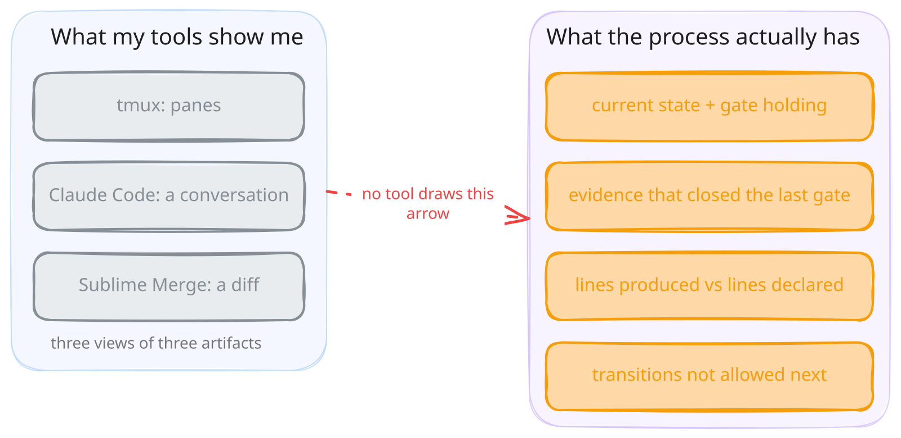

<figure style="float: left; width: 300px; margin: 0 1em 1em 0;" markdown>
  
  <figcaption>
    Sulutor Lakes. The only gate up here is the weather, and it's the only one that actually gets enforced.
  </figcaption>
</figure>

Today I cancelled my JetBrains subscription. Cancelling subscriptions is a popular trend right now, except the ones people announce dropping are Claude, ChatGPT, whichever model annoyed them this week. I went the other way. The models stay. The IDE goes. For a line item on a credit card statement it feels more symbolic than it should.

I have always been a Vim person. That never changed, and it isn't changing now. But I have been paying JetBrains since 2012, because for a long time Vim lost on two things. Navigation was the real gap: before language servers you had ctags, which is a text index pretending to understand code. No types, no scopes, five candidates for every common name. The other gap was visual. An IDE highlights faster and shows more, errors and types painted onto the code before you ask for them. Language servers closed the first gap. The second one JetBrains still wins, and the rest of this post is about why that no longer buys anything.

Somewhere along the way the reason changed. The products stopped being the thing I was buying and started being the thing I was supporting. If you want a good product to keep existing, the most honest thing you can do is pay for it, so I kept paying. Fourteen years of that.

<!-- more -->

## What is actually on my screen in 2026

tmux for splits, Vim in most of them. Claude Code and Codex for writing code. Typora for reading and writing documents. Sublime Text and Sublime Merge for the cases where Vim is inconvenient, which in practice means big merge requests with a lot of changes, where I want a fast visual diff and nothing else.

There is no IDE in that list, and nothing lighter took its slot. The function it performed left my hands entirely.

## The IDE is very good at something I no longer do

Completion, refactoring, jump-to-definition, inline inspections: the whole apparatus exists to make one person produce and navigate code by hand, quickly. It's excellent apparatus. Thirty years of work went into it and it shows.

I don't do that anymore. Writing code by hand in 2026 is an inefficient use of a senior engineer's day. Less politely: it's stupid. My time goes into deciding what should be built, putting a fence around it, and checking what came back against the fence. None of that happens in a buffer.

Nothing is wrong with JetBrains. Their tools are as good as they ever were. The category is what expired.

The obvious objection is the AI-native editors, Cursor and its relatives, and I don't think they change the argument. Putting a model next to the buffer gives you a faster buffer. The buffer is not where my day goes. They are still code-centric tools; they just generate the code instead of autocompleting it.

## What I would pay for and nobody sells

Here is where my money would go if the product existed.

My workflow with LLMs is a state machine. Research, design, design review, implementation, code review, verification, and back around. I drew the whole thing out earlier[^1], so I won't repeat it here. What matters is the shape: states, transitions, entry conditions, and gates that a transition is not allowed to skip.

Nothing on my screen understands any of that. tmux shows panes. Claude Code shows a conversation, a long one. Sublime Merge shows a diff. Three views of three artifacts, and no view of the process that produced them.

{ width="1024" }

I want the opposite. Show me which state I'm in and which gate is holding. What evidence closed the last one? How much code did the last transition produce, against how much was declared up front? Then the part no tool even attempts: what is not allowed to happen next. And let me tune agent behaviour in one place, visually, instead of editing a scattered tree of markdown files and hoping the model reads the one I meant.

To be clear about the shape: this is not a CI harness. Orchestrators like Bernstein[^2] take a goal in one end and hand back a verified merge at the other, and that's useful, but I'm inside the loop at every transition, and the tool has to be too. Kiro[^3] got closer by putting requirements, design and tasks into the interaction itself, then wrapped it around a code editor and left the gates as conventions.

## Non-determinism needs rules, not vibes

Underneath all of that is one problem: predictability.

I wrote last month about a feature I'd sized at roughly 200 lines coming back as 8,391 added[^4]. Nothing went off the rails. Every guard defended against something real, every review finding was correct, and the total was still absurd. The fix I landed on was making each design option declare what it costs, so the expensive option has to justify itself against a number instead of against adjectives.

That's a rule. Right now it's enforced by being written as prose in a template that I then read carefully, which is the weakest enforcement mechanism available to a human being.

What I want is somewhere to declare rules like that and have something check them. The volume of code a transition may produce is bounded, and the bound is declared before the transition starts. Verification runs before a state can be exited, no exception for changes somebody labelled trivial. A finding doesn't close without evidence attached. Implementation doesn't start without an approved design review. I have every one of those rules today, written down. Nothing checks them.

This problem has been solved before, for a different flavour of non-determinism. P[^5], which started at Microsoft and now lives at AWS, is a language where you model a system as communicating state machines and hand it to a checker that explores message interleavings and failures against the correctness specifications you wrote. It's not academic furniture: P shipped the USB 3.0 drivers in Windows 8.1 and Windows Phone, and teams across AWS use it on S3, EBS, DynamoDB, MemoryDB, Aurora, EC2 and IoT to reason about whether their designs are correct[^6]. The non-determinism there comes from interleaving and node failure. Mine comes from a sampling distribution. Different source, same shape: a system whose behaviours you cannot enumerate by hand, with properties you still need to hold.

I am not asking for a model checker over agents. That isn't a coherent thing to want: the state space is natural language, there is nothing to exhaustively explore. What I want is P's posture without P's rigour. An explicit state machine instead of an implied one. Specifications of what must hold, written where a program can read them, and monitors that shout when a run violates one. P calls those spec monitors and runs them twice: against the model during verification, and afterwards against production logs, through a tool called PObserve[^6]. The second half is the part I could use tomorrow.

Call it a P for LLM workflows. Looser than the original, but with rules that are real.

## So I'm building a bad version of it myself

Since it doesn't exist, I've been inventing it, badly, for about a year. A command per phase. An agent per role. A contract file every model reads on entry. YAML state that survives task switching. Consensus review with an inclusion threshold[^7], because a single agent's opinion isn't worth acting on. Fix loops with iteration caps. It works well enough that I stopped considering the alternative[^8].

It is also, honestly described, a state machine implemented as prose and handed to a language model with a polite request that it comply. The rules are suggestions, the gates are conventions, and nothing anywhere in the system can say no.

I know exactly how weak that is, because I went looking. Three separate files in my configuration asserted something about review history that was flatly untrue, and had been for months[^4]. Nothing caught it, because nothing in the system is capable of catching anything. A tool with a real notion of state would have failed on the first transition that depended on it.

## Where this lands

The IDE industry spent three decades optimising the production of code, and did an outstanding job. Then the bottleneck moved somewhere else, and the whole category is still standing where the bottleneck used to be.

I don't miss the IDE. I miss having somewhere to put the rules. Whoever ships that gets my next fourteen years.

[^1]: [Development processes in the GenAI era. sysdev.me, January 2026.](https://sysdev.me/2026/01/14/development-processes-in-the-genai-era/)
[^2]: [Bernstein: the open-source governance layer for AI agents. GitHub, sipyourdrink-ltd/bernstein.](https://github.com/sipyourdrink-ltd/bernstein)
[^3]: [Kiro: an agentic IDE with specs, hooks and steering. AWS.](https://kiro.dev)
[^4]: [Over-engineering used to be bounded by boredom. sysdev.me, August 2026.](https://sysdev.me/2026/08/10/over-engineering-used-to-be-bounded-by-boredom/)
[^5]: [P: A programming language designed for asynchrony, fault-tolerance and uncertainty. Microsoft Research, May 19, 2017.](https://www.microsoft.com/en-us/research/blog/p-programming-language-asynchrony/)
[^6]: [The P programming language. Documentation and case studies.](https://p-org.github.io/P/)
[^7]: [Making GenAI code review actually useful. sysdev.me, February 2026.](https://sysdev.me/2026/02/19/making-genai-code-review-actually-useful/)
[^8]: [Vibe Coding experiment. sysdev.me, March 2026.](https://sysdev.me/2026/03/25/vibe-coding-experiment/)
