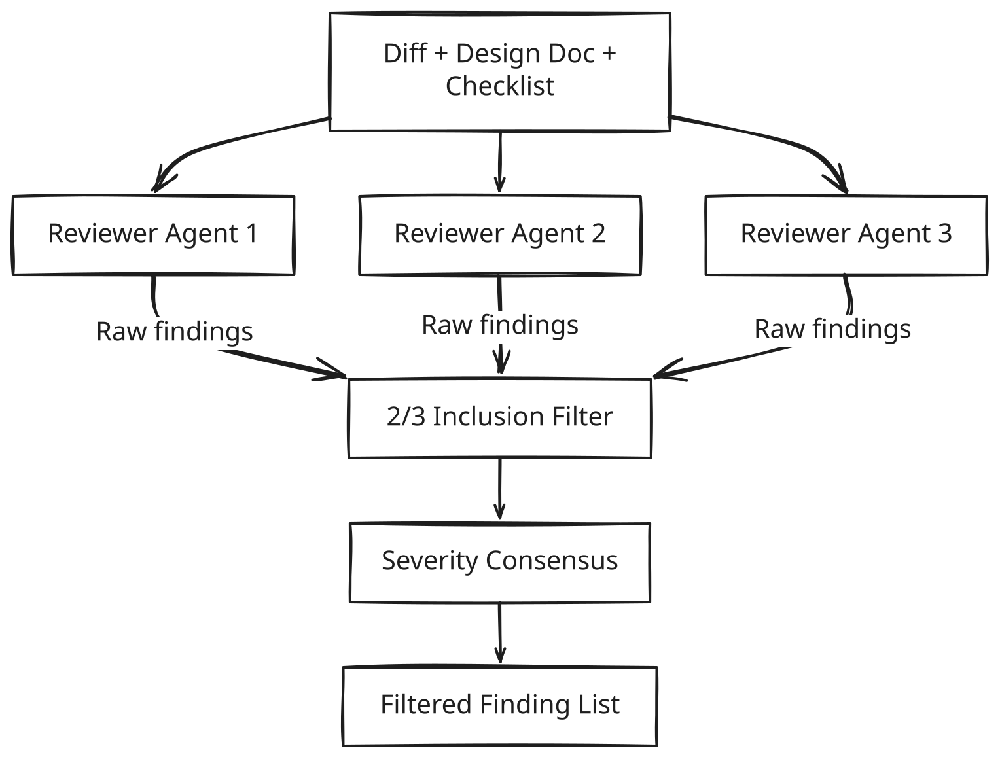
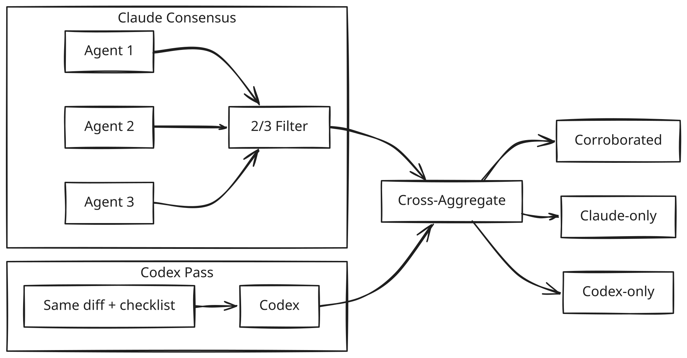

<figure style="float: left; width: 300px; margin: 0 1em 1em 0;" markdown>
  
  <figcaption>
    Alamedin Gorge is one of my favorite places for a short weekend walk.
  </figcaption>
</figure>

I ran a single Claude reviewer agent against an approximately 1000-line C++ change last month (yes, it's too big for a normal workflow, but we are in the GenAI era and norms are different)—some pretty important video pipeline updates, but nothing exotic. The review came back with 14 findings. Three were real. The rest included a phantom race condition in code that runs on a single thread, two style nitpicks elevated to High severity, and a complaint about missing error handling on a function that already returns `std::expected`. The signal-to-noise ratio was bad enough that I almost closed the tab.

This is the dirty secret of GenAI-assisted code review. The models are good enough to spot real issues, sometimes ones a tired human would miss. But they also hallucinate problems with enough confidence to waste your time, and the false positives are not random. They cluster around the same blind spots every run because they come from the same weights, the same training distribution, the same biases baked into one model family.

I wrote about the false positive problem briefly in my earlier piece on development processes in the GenAI era[^1], but I didn't have a concrete solution at the time. Now I do, and it's been running in my workflow for a few weeks. The short version: stop asking one agent. Ask three, and only keep what two of them agree on.

<!-- more -->

## Why single-agent review fails predictably

The intuition is that running a model three times should give you roughly the same output three times. That's wrong, and understanding why is the key to making this work.

LLM generation is not deterministic in practice (even at temperature zero, batching and floating-point ordering introduce variation). Each independent run samples a different path through the model's latent space. One run might fixate on thread safety and miss an error-handling gap. Another might catch the error handling gap and hallucinate a performance concern. The overlap between runs is where the model is confident *and* correct. The divergence is where it's guessing.

Single-agent review gives you no way to distinguish between these. Every finding arrives with the same authoritative tone. A real race condition and a phantom one look identical in the output. So you end up doing the thing GenAI was supposed to save you from: reading every finding carefully, mentally re-deriving whether it's valid, and throwing away half of them. At that point you're doing a code review with extra steps.

The problem compounds over time. Engineers who get burned by false positives stop trusting the review output. They start skimming or skipping it entirely. And then the real findings, the ones the model actually caught, get ignored too. Trust erosion is the failure mode, not any single bad finding.

## The 2/3 inclusion rule

The fix is conceptually simple. Run three independent reviewer agents against the same change. Each agent gets the same input: the diff, the design document (if one exists), and the review checklist. They don't see each other's output. Three separate invocations, three separate generation paths.

Then apply one rule: a finding only makes it into the final review if at least two out of three agents flagged it independently. Everything else gets dropped.

{ width="1024" }

The 2/3 inclusion threshold is the noise filter. It works because the false positives from independent runs are mostly uncorrelated, they come from different hallucination paths, so they rarely overlap. Real issues, on the other hand, tend to be visible from multiple reasoning paths because they're grounded in actual code problems, not model artifacts.

In practice, this cuts the finding count roughly in half while keeping nearly all the real issues. The phantom race condition from my cache invalidation review? Only one agent flagged it. Gone. The actual missing bounds check on an index parameter? All three caught it.

## Severity consensus

Filtering findings is only half the problem. The other half is severity. One agent calls something Critical, another says Medium, the third says High. Which one do you trust?

I use a simple rule. If two or three agents agree on severity, that's the severity. If all three disagree (say Critical, High, and Medium), take the middle one. This isn't sophisticated. It doesn't need to be. The goal is to prevent a single agent's tendency to catastrophize from dominating the output.

The resolution rules:

| Agent votes | Severity used |
|---|---|
| 2/2 or 3/3 agree | Agreed severity |
| 2 agree, 1 differs | Majority severity |
| All 3 differ | Middle severity (Critical > High > Medium > Low) |

The alternative is letting the highest severity win, which is what most people default to. That's a mistake. It biases every review toward alarm, which feeds right back into the trust erosion problem. If every finding is Critical, nothing is.

## Cross-model verification

The consensus protocol handles intra-model noise well. But there's a second failure mode it doesn't address: systematic blind spots shared across all three runs because they come from the same model family.

Claude (to pick the obvious example, since that's what I use for review agents) has specific patterns it over-indexes on and specific patterns it consistently misses. Three Claude runs will share those biases. The 2/3 rule filters random noise, not systematic noise.

The obvious next step is a cross-model pass. After the Claude consensus, run the same review through a different model family (OpenAI's Codex, in my case) as an independent verifier. Codex sees the same diff and checklist but produces its own findings without seeing the Claude output. Then cross-aggregate: findings that both families flag get marked as corroborated, Claude-only findings stay as-is, and Codex-only findings get included but labeled clearly so you know they didn't survive the primary consensus.

{ width="1024" }

The corroborated findings are almost always real. A finding that survives the 2/3 Claude consensus and independent Codex verification has been a genuine issue every time I've checked. That part works.

What I'm less sure about is the right protocol around Codex-only findings. Right now I include them with a label and review them manually, which is fine at low volume. But the question I keep circling back to is whether the right move is to feed Codex-only findings back to Claude for re-verification. That creates a tighter loop: Codex catches something Claude missed, Claude gets a second chance to evaluate it with the specific finding in front of it. The risk is that Claude just agrees because the finding is now in the prompt, which would defeat the purpose of independent verification.

The other option I haven't tried yet is running multiple Codex instances with the same 2/3 consensus approach, then cross-aggregating two independent consensus outputs. That's more compute, but it would give the cross-model step the same noise filtering the primary review gets. Right now, a single Codex run is a single opinion, and I already know why single opinions are unreliable (that's the whole premise of this article).

I don't have a settled answer here. The single Codex pass is good enough to catch systematic Claude blind spots, and the corroboration signal is strong. But the handling of Codex-only findings feels like it needs another iteration. If you're implementing something similar, this is the part I'd expect to change first.

## What the agents should not flag

The protocol is only as good as the instructions each agent receives. One thing I learned early: you have to explicitly tell the reviewer agents what to ignore, not just what to look for.

Without explicit exclusions, GenAI reviewers love to flag pre-existing issues that have nothing to do with the change under review. They'll also flag style preferences as if they were correctness problems, and raise speculative bugs that depend on specific inputs without any evidence those inputs are reachable. A senior engineer would never raise these in a review. The model will, confidently, every time.

My reviewer agents get explicit instructions to skip: pre-existing issues not introduced by the current change, subjective style preferences, potential bugs without clear evidence of reachability, and nitpicks a senior engineer would dismiss. This doesn't eliminate all noise (that's what the 2/3 rule is for), but it reduces the volume each individual agent produces, which makes the consensus step cleaner.

For what it's worth, I run this full protocol (three Opus reviewer agents, Codex cross-model pass, plus separate agents for research, implementation, and debugging) on a $100/month Claude Pro plan. After a full working week, my usage sits around 20 to 30 percent. The consensus approach sounds expensive when you describe it in the abstract. In practice, if you keep your changesets small and your review inputs focused, it barely dents the budget.

## What this doesn't solve

The consensus protocol is a noise filter. It makes GenAI review signal usable. It does not make GenAI review authoritative.

Formal correctness guarantees still come from static analysis, testing, and runtime instrumentation. The consensus review is a complement to those, not a replacement. It catches the category of issues that are visible in code but not caught by automated tooling: design adherence gaps, missing error handling strategies, observability blind spots, and subtle concurrency concerns that a linter won't flag.

And it still requires a human at the end. The engineer reviews the filtered findings and makes the final call. The protocol reduces the volume of findings to something a human can actually process without fatigue, which is the whole point. GenAI review that produces 14 findings is a chore. GenAI review that produces 5 high-confidence findings, with the noise already removed, is a tool.

[^1]: [Development processes in the GenAI era. sysdev.me, January 14, 2026.](https://sysdev.me/2026/01/14/development-processes-in-the-genai-era/)

