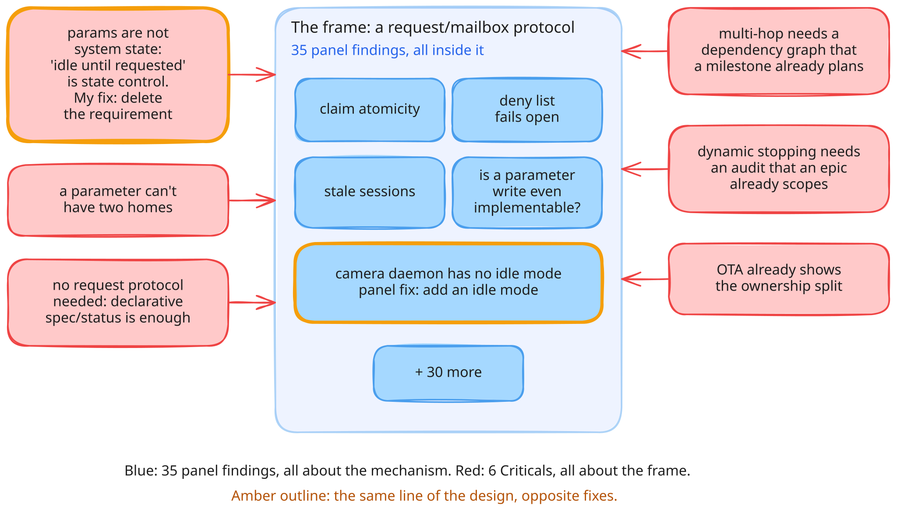
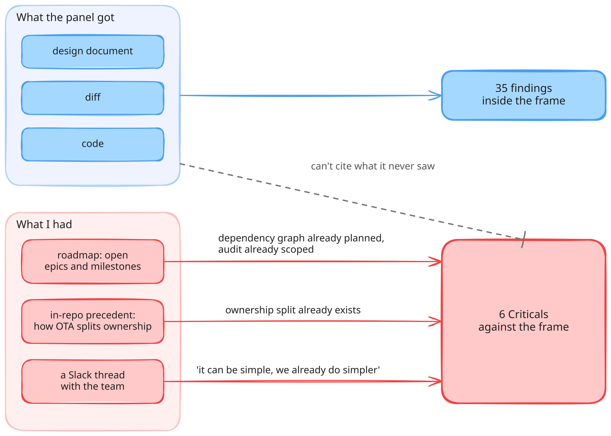
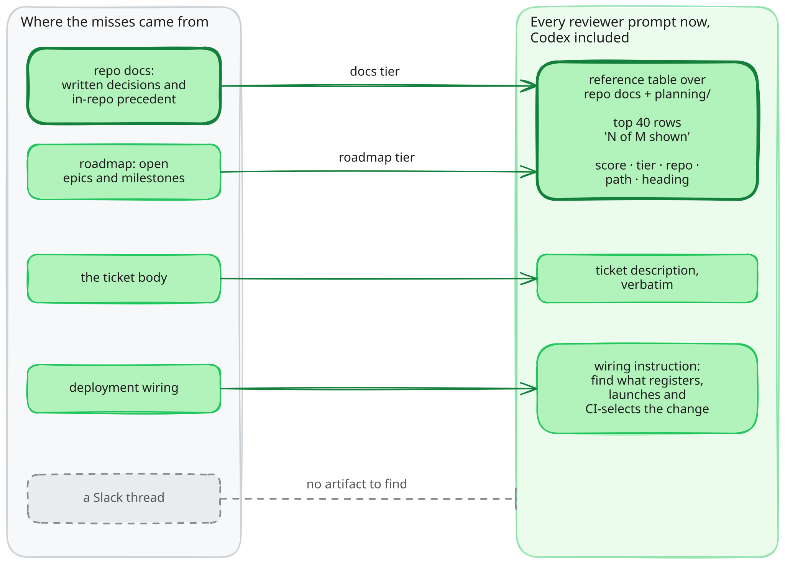
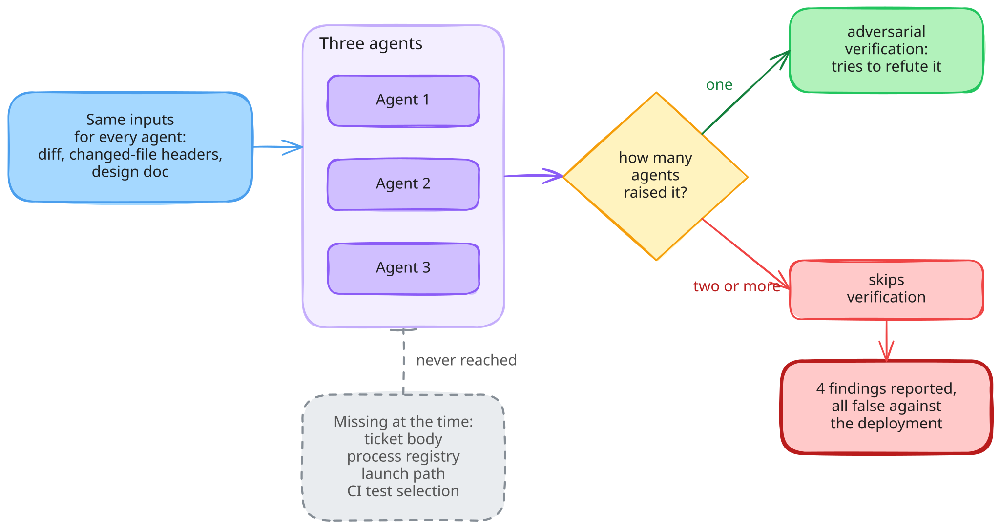

<figure style="float: left; width: 300px; margin: 0 1em 1em 0;" markdown>
  
  <figcaption>
    Kok-Moinok lake, eleven kilometres and 1,100 metres above the trailhead. No preview on the way up: you get the whole thing at the end or nothing.
  </figcaption>
</figure>

When a model gets something wrong, we reach for the same words: it hallucinated, it ignored the instructions, it isn't smart enough yet. Sometimes that's true. More often, in my experience, the model did a decent job with what it was given, and what it was given was thin.

Think about what makes a developer good on a project they've been on for a while. It's rarely typing speed. It's the context they carry around: which approaches were tried and dropped, which subsystem already solves a similar problem, and above all why each decision was made. None of that is in the diff. It lives in their heads, in the docs, in old tickets, in a Slack thread nobody bookmarked.

A model can use that context too, to a degree, if we hand it over. The question is how: which inputs, in what shape, and how much of them.

Here's the review that made me take that question seriously.

<!-- more -->

## Two reviews, one document

A few weeks ago a design MR proposed a request/mailbox protocol for feature control. My review setup went through it (three Claude reviewers and a Codex cross-model pass, plus adversarial verification for anything only one agent raised[^1]) while I read the same document myself.

The panel returned 35 findings. Claim atomicity, a deny list that fails open, stale sessions, a camera daemon with no idle mode. Every one of them was correct.

I returned six Criticals, and none of them was on the panel's list.

One pair shows the gap. The panel found that the camera daemon has no idle mode, so "idle until requested" can't be implemented: add an idle mode. I found that "idle until requested" is state control, which this mechanism shouldn't touch at all: delete the requirement. Same line of the design, opposite fixes.

Fixing all 35 would have produced a self-consistent design of the wrong system. I posted the six and held the rest back, since most of them die once the frame changes.

{ width="1024" }

*35 findings inside the frame, 6 Criticals aimed at the frame itself. The bold pair is the same line of the design.*

## What I had that they didn't

Look at where my six came from.

Two of them pointed at work the roadmap already owned: a milestone planning the dependency graph that multi-hop requests need, and an epic scoping the audit that dynamic stopping depends on. One pointed at OTA, which already splits config ownership the way this design was trying to reinvent. And I'd already told the team in Slack that this could be simple, and that we already do something simpler. No reviewer prompt was ever going to include that thread.

The panel got the document, the diff and the code, with no browsing allowed. Not the repo's docs, where almost every decision on this project is written down. A reviewer can't cite what it was never given.

{ width="1024" }

Missing inputs aren't the only cause. Role bias works against premise attacks too, and so does the way consensus treats a lone dissent. Those get their own post. This one is about the inputs.

## So give them more context

The fix follows from that picture: hand every reviewer the inputs my Criticals came from, or as many of them as exist in writing. On this project that's most of them. Since mid-September the MR review gives every agent three more inputs.

The first, and the one that matters most, is a reference table over those docs. [projctl](https://github.com/astavonin/projctl), my open-source CLI for this workflow, has a `search docs` command: offline BM25 over the repo's docs root and its `planning/` tree, with every matched Markdown section sorted into a tier such as `docs`, `roadmap`, `failure`, `alternative` or `constraint`. The top 40 go into the prompt as rows of score, tier, repo, path and heading, with no body text at all.

A row costs a line and a body costs a page, so reviewers get the rows and open the bodies they want.

The second is the ticket. On a bug-fix MR the same week, the review command called `projctl load issue` to find the epic folder, kept that one line and dropped the description, the one part that explained the change. An intentional change came back as a defect. Now the description travels verbatim from the same call.

The third comes from the same bug-fix MR, where one finding rested on a 3 MiB log record that exists only in a test fixture. The instruction is one sentence: before judging whether something can happen, find what registers the changed code to run, what launches it and what CI selects. It names no paths, because those differ per repo.

Codex gets all three through its review-request document, since that's the only thing it reads.

{ width="1024" }

*Everything that was written down now reaches every prompt. The Slack thread still doesn't.*

Two details matter as much as the search itself. The table opens with its query, its flag state and `N of M shown`, so a table cut at 40 rows never reads as full coverage. And the prompt frames everything as inputs, not gates:

[`platforms/claude/commands/review-mr.md:121`](https://github.com/astavonin/genai-automations/blob/5d7ac1c/platforms/claude/commands/review-mr.md#L121)

> a hit in the `failure` or `alternative` tier is prior art to weigh, not a directive, and a reviewer handed unframed prior art treats it as authority and stops reasoning instead.

Measured against my six Criticals, that covers most of the ground. The two roadmap ones now have a tier of their own, and precedent like OTA arrives through the docs. The Slack thread stays out, and so does anything else nobody wrote down.

## Three agents, one opinion

My consensus protocol has a shortcut. A finding raised by only one agent goes to adversarial verification, where another agent tries to refute it. A finding raised by two or more skips that step, on the theory that independent readers agreeing is evidence.

The readers aren't independent, though. Every agent gets the same inputs, so whatever is missing from them, all three miss together, and their agreement waves the mistake past the one step built to catch it.

On the bug-fix MR, four findings were coherent against the diff and false against the deployment. Two questions from me killed them: "is it real or theoretical?" and "check the ticket description and the MR text". Every one of the four had been raised by more than one agent, so none of them ever reached verification.

{ width="1024" }

*Three agents, one input, one opinion counted three times.*

Richer inputs shrink what's missing, but every agent still gets the same richer set. So agreement should count as a prior at most: a finding that claims something can happen at runtime needs verifying however many agents raised it.

## Reading the proposal last

Inputs are the cheap fix, and they leave the order untouched: every reviewer still reads the proposal first, and whatever it reads first becomes its frame.

Next is a counter-designer: an agent that gets only the problem statement, the roadmap and an instruction to diff against the nearest in-repo precedent, writes the minimal design it would build, and only then reads the proposal. The calibration set already exists: the design MR from the top of this post. If it finds even one of my six Criticals without me in the loop, that's the next post.

## Code paths touched

- [`projctl/handlers/docs_search.py`](https://github.com/astavonin/projctl/blob/0138e50/projctl/handlers/docs_search.py): the BM25 search and the reference table it renders
- [`platforms/claude/commands/review-mr.md`, Step 3b](https://github.com/astavonin/genai-automations/blob/5d7ac1c/platforms/claude/commands/review-mr.md#L87-L98): the three inputs every MR reviewer now gets

[^1]: [Making GenAI code review actually useful. sysdev.me, February 2026.](https://sysdev.me/2026/02/19/making-genai-code-review-actually-useful/)
