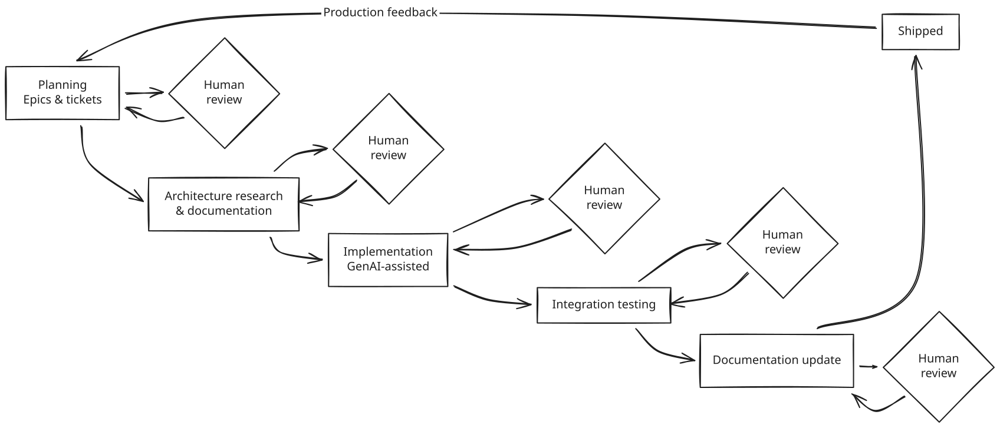
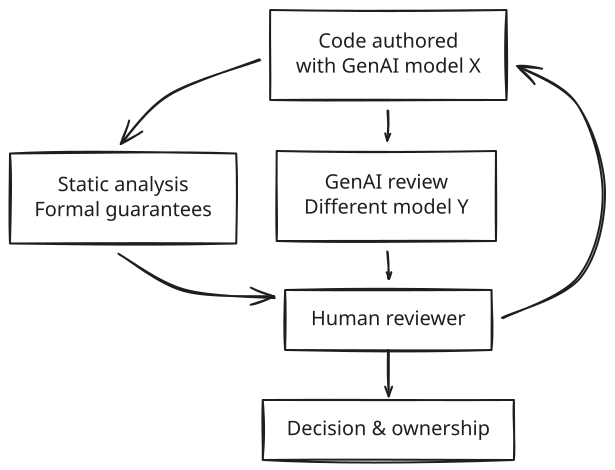
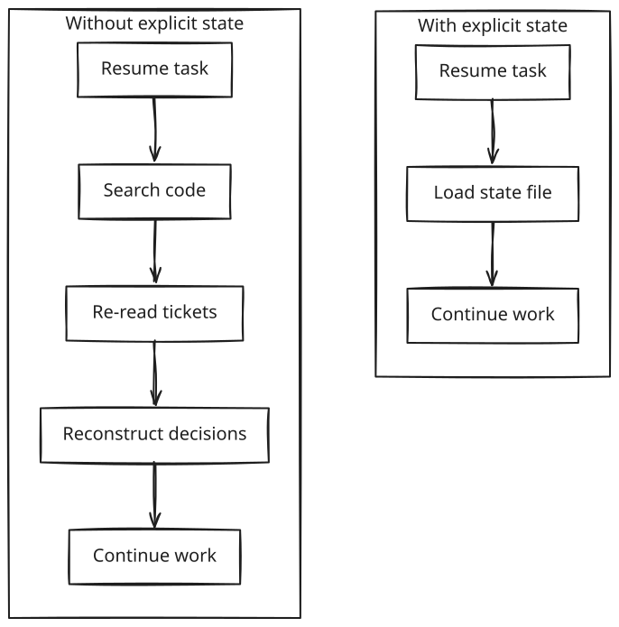
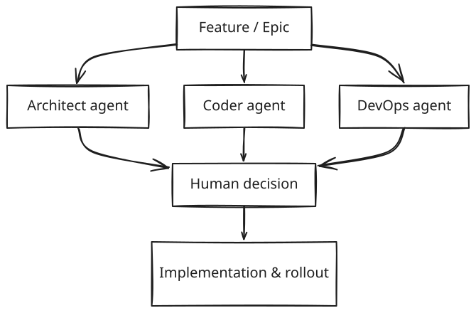

<figure style="float: left; width: 300px; margin: 0 1em 1em 0;" markdown>
  
</figure>

The current debate around GenAI and C++ is a good illustration of the real problem. Many engineers report that models are worse than juniors. Others report dramatic speedups on the same language and problem space. Both observations are correct.

The difference is not the model. It is the absence or presence of the state.

Most GenAI usage today is stateless. A model is dropped into an editor with a partial view of the codebase, no durable memory, no record of prior decisions, no history of failed attempts, and no awareness of long-running context. In that mode, the model behaves exactly like an amnesic junior engineer. It repeats mistakes, ignores constraints, and proposes changes without understanding downstream consequences.

When engineers conclude that “AI is not there yet for C++”, they are often reacting to this stateless setup.

At the same time, GenAI does not elevate engineering skill. It does not turn a junior into a senior. What it does is amplify the level at which an engineer already operates. A senior engineer using GenAI effectively becomes a faster senior, and a junior becomes a faster junior. Judgment is not transferred, and the gap does not close automatically.

These two facts are tightly coupled. In stateless, unstructured usage, GenAI amplifies noise. In a stateful, constrained workflow with explicit ownership and review, it amplifies competence.

This is why reported productivity gains vary so widely. Claims of 200–300% speedup are achievable, but only locally and only within the bounds of the user’s existing competence. Drafting, exploration, task decomposition, and mechanical transformation accelerate sharply. End-to-end throughput increases are lower because planning, integration, validation, and responsibility remain human-bound.

The question, then, is not whether GenAI is “good enough”. The question is what kind of system you embed it into.

!!! note
    Everything I'll explain below is **only** applicable to the **Stateful GenAI** setup. 

<!-- more -->

## Stateless vs Stateful

## What changed and what did not

One fundamental shift is that everyone becomes a TPM, at least a little. GenAI moves the bottleneck from typing to coordination. Breaking work into coherent tasks, sequencing dependencies, tracking risk, and explaining intent clearly now dominate more of the day. Engineers with prior TPM experience adapt faster. Others find it uncomfortable at first, but the skill is learnable.

There is a failure mode here. When coordination skills are weak, work fragments into tickets that lose architectural coherence, or decisions get made implicitly inside prompts instead of explicitly in reviews. That is why process matters more as velocity increases, not less.

Another thing that did not change is the nature of GenAI itself. These systems are powerful pattern matchers, not reasoning engines. They accelerate drafting and exploration, but they do not replace engineering judgment. Humans remain the source of truth for architecture, correctness, performance, concurrency guarantees, undefined behavior, and production readiness. There are entire classes of problems where trusting model output is actively dangerous, especially in low-level or highly concurrent systems.

## Process matters more under higher speed

GenAI allows more change in less time. Without discipline, that extra change turns into larger merge requests, unclear ownership, brittle integration, and review fatigue. GenAI amplifies whatever process you already have, good or bad.

A practical end-to-end flow that works well looks roughly like this: planning, architectural research and documentation, implementation, integration testing, and documentation updates. Every stage includes a mandatory human review. GenAI can assist, but it cannot be the approver.

Ownership is explicit. The engineer who initiated the change remains accountable throughout. GenAI is treated like a junior contributor that can draft and suggest, not like an authority. Peer review at the end is mandatory, but the author is always the first human gatekeeper.

{ width="1024" }

Review gates are not overhead. They are the control mechanism that prevents increased speed from degrading correctness.

## Code review and validation

Manual review quality degrades as the change size increases. Unfortunately, GenAI assistance does not remove this limitation; changes must remain small and coherent to remain reviewable under higher throughput. GenAI-based review tools generate useful signals but also a high rate of false positives in complex systems code. Review output must be treated as hypotheses. Formal guarantees still come from static analysis, testing, and runtime instrumentation. 

Cross-model review reduces correlated failure modes. Different models tend to fail differently and can unblock each other. Human reviewers arbitrate conflicts and retain decision authority.

{ width="640" }

!!! warning Failure mode without control

    Without structure, GenAI introduces a reinforcing failure loop. Increased change volume leads to unfamiliar code and larger diffs. Review fatigue follows, then shallow validation, latent defects, incidents, and loss of trust. Velocity declines as rework dominates.

    **Process discipline exists to break this loop.**

## Traceability, task switching, and state

Higher iteration speed increases task switching. This is not a focus problem. It is a structural consequence of discovering constraints late. The same pattern exists without GenAI. When a hard dependency is discovered during implementation, scope is reduced, new tasks are created, work is paused, and attention shifts elsewhere. The difference is not the mechanism, but the frequency. GenAI accelerates the path to constraint discovery, which makes these transitions happen earlier and more often.

A common pattern is partial implementation followed by discovery of a hard dependency. Work pauses while the dependency is resolved. The primary cost is not the interruption, but the effort required to resume.

A persisting feature or epic state in a small, human-readable file externalizes working memory. The state captures what was discovered, why work stopped, which assumptions changed, and what the next action is. This reduces reload cost and enables both humans and models to resume work deterministically.

This mechanism is particularly effective across weekends and public holidays, where implicit context is most likely to be lost.

{ width="640" }

## Multi-agent workflows

Single-agent GenAI workflows collapse architectural, implementation, and operational concerns into a single output. This does not scale.

From an LLM perspective, all decisions in a single-agent setup are derived from the same prompt, context window, and latent state. Assumptions are shared across concerns and are not independently challenged. As scope grows, the model resolves competing objectives implicitly within one generation path, which causes errors to become correlated. Design mistakes propagate directly into code and operational logic, and incorrect assumptions are rarely revisited once embedded in the output.

To scale safely, independent reasoning paths are required. At a minimum, separate agents should reason independently about structure, correctness, and operability. Disagreement between agents is expected and desirable. Humans arbitrate conflicts and retain ownership.

{ width="640" }

## YAML-based epic and feature state

Persisting state requires a concrete, durable representation. In practice, YAML works well for this role.

Epic- and feature-level YAML files act as shared execution state for humans and GenAI agents. They capture intent, scope, constraints, and current understanding in a form that is diffable, reviewable, and version-controlled. Unlike conversational context, this state survives task switching, interruptions, and tool changes.

These files intentionally describe *what* needs to be achieved rather than *how* it should be implemented. Outcome-focused descriptions and acceptance criteria prevent premature design decisions from being embedded into state and allow independent reasoning by both humans and agents.

Validation at the state boundary keeps the structure intact as the iteration speed increases. Required sections, label constraints, and basic consistency checks ensure that the state remains predictable and reviewable over time.

YAML state does not replace issue trackers. Trackers remain the system of record for execution and discussion. The YAML files represent the current shared understanding of the work and serve as a stable input contract for GenAI usage.

!!! example
    A concrete example of this approach, including templates and validation rules, is covered in a separate article.

## Cross-model consistency and shared state

Using multiple models introduces inconsistency unless entry conditions are controlled. A single repository-level agent contract, such as `AGENT.md` or `CLAUDE.md`, provides a stable starting point for all models. In practice, this file is shared across tools, often via symlinks, to ensure that different models operate under the same constraints.

The agent contract defines global invariants: coding standards, validation requirements, review expectations, and links to authoritative documentation. It does not duplicate domain knowledge. Its role is to fix assumptions at the boundary and make them explicit.

On its own, this is not sufficient. The agent contract establishes *how* models should behave, but not *what* they are working on. That role is filled by explicit task and execution state, represented in YAML at the epic and feature level. Together, the agent contract and YAML state form a minimal, durable memory for GenAI-assisted workflows.

This combination addresses the primary failure mode of GenAI systems. Statelessness. Models no longer infer intent from partial diffs or conversational history. They enter with fixed rules and consume explicit state. Memory becomes an artifact, not an assumption.

## Costs and constraints

GenAI-assisted development introduces costs that follow directly from its operating model. Effective usage typically involves multiple models, trading latency and cost for correctness and review quality. Inference cost is usually small relative to senior engineer time but becomes a predictable infrastructure expense at scale. The relevant metric is cost per accepted change.

The dominant non-monetary cost is cognitive. GenAI replaces typing with validation. Engineers spend more time reading diffs, checking assumptions, resolving contradictions, and restoring context. This resembles continuous code review and leads to faster fatigue if unmanaged.

There is also a process cost. Large gains require explicit state, strict ownership, small changesets, role separation, and shared contracts. These controls add upfront overhead but prevent regression in correctness and operability.

---

GenAI increases the rate at which change is produced. It does not reduce system complexity, validation requirements, or engineering responsibility.

Sustained gains require explicit state, clear ownership, disciplined review, role separation, and controlled entry points. Without these, GenAI accelerates failure as efficiently as it accelerates delivery.

Used as part of a system, GenAI is a force multiplier. Used in isolation, it is noise.

!!! warning
    GenAI rapidly evolves. Meaning, this info is valid as of Jan 2026 and may no longer be valid.

