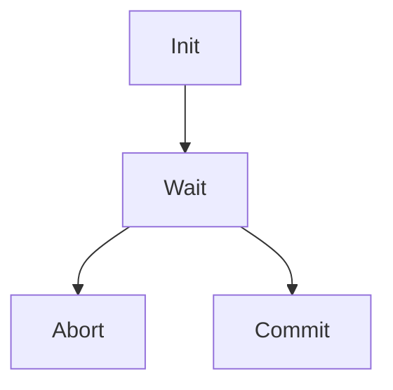

<figure style="float: left; width: 300px; margin: 0 1em 1em 0;" markdown>
  <a href="https://sysdev.me/img/fsm.png" target="_blank">
    
  </a>
</figure>

Design patterns are not widely used in Go, as they can often lead to unnecessary complexity in the codebase. However, the Finite State Machine (FSM) is an exception that proves to be incredibly useful. When I set out to design [GFSM](https://github.com/astavonin/gfsm), I aimed to create a fast and straightforward FSM implementation for Go.

I initially sought a quick and straightforward FSM solution for Go, but I couldn't find anything that met my needs. Drawing inspiration from the speed-focused and minimalistic principles of C++ while remaining true to Go's idioms, I developed [GFSM](https://github.com/astavonin/gfsm) to fill this gap. The outcome is GFSM—a library that distinguishes itself from alternatives like [looplab/fsm](https://github.com/looplab/fsm) by prioritizing speed and simplicity.

Whether orchestrating microservices, handling distributed systems, or designing embedded systems, [GFSM](https://github.com/astavonin/gfsm) brings the reliability and efficiency needed to keep things running smoothly.
<!-- more -->
## Real-World Use Case: Two-Phase Commit Protocol

One of the best showcases for FSMs is the [Two-Phase Commit protocol (TPC)](https://en.wikipedia.org/wiki/Two-phase_commit_protocol), widely used in distributed systems to ensure atomic transactions. Let’s explore how GFSM can model this protocol step by step.

### 1. Define Your State Machine

To build a TPC protocol FSM, we start with a basic state machine:



This state machine has four states:

- `Init`: The initialization phase.
- `Wait`: Waiting for votes.
- `Abort`: Aborting the transaction.
- `Commit`: Committing the transaction.

### 2. Enumerate All Possible States

GFSM allows any `comparable` type as state identifiers, but integer-based enumerations keep things clean and fast. For TPC, here’s how the states are defined:

```go
type State int
const (
    Init State = iota
    Wait
    Abort
    Commit
)
```

### 3. Define State Behaviors

Each state in GFSM is represented by an action handler implementing the `StateAction` interface:

```go
type StateAction[StateIdentifier comparable] interface {
    OnEnter(smCtx StateMachineContext)
    OnExit(smCtx StateMachineContext)
    Execute(smCtx StateMachineContext, eventCtx EventContext) StateIdentifier
}
```

- `OnEnter`: Called when entering the state.
- `OnExit`: Called when leaving the state.
- `Execute`: Handles events and determines the next state.

For example, the `initState` implementation might look like this:

```go
func (s *initState) Execute(smCtx gfsm.StateMachineContext, eventCtx gfsm.EventContext) State {
    cCtx := smCtx.(*coordinatorContext)
    req, ok := eventCtx.(commitRequest)
    if !ok {
        // Handle invalid event
        return Init
    }
    // Transition logic
    return Wait
}
```

### 4. Build the State Machine

Using the `StateMachineBuilder`, you can define the states, their transitions, and the associated context:

```go
sm := gfsm.NewBuilder[State]().
    SetDefaultState(Init).
    SetSmContext(&coordinatorContext{partCnt: 3}).
    RegisterState(Init, &initState{}, []State{Wait}).
    RegisterState(Wait, &waitState{}, []State{Abort, Commit}).
    RegisterState(Abort, &responseState{
        keepResp: Abort,
    }, []State{Init}).
    RegisterState(Commit, &responseState{
        keepResp: Commit,
    }, []State{Init}).
    Build()
```

Here, `coordinatorContext` holds transaction details, such as the number of participants and the commit ID.

### 5. Run the State Machine

Once constructed, the FSM is ready to process events. Start the state machine, handle events, and gracefully terminate it:

```go
sm.Start()
defer sm.Stop()

err := sm.ProcessEvent(commitRequest{"commit_1"})
if err != nil {
    // Handle error
}
```

During event processing, the FSM delegates logic to the current state’s `Execute` method, determining whether to transition or remain in the current state.

## Learn More
Ready to integrate GFSM into your project? Check out the [documentation on pkg.go.dev](https://pkg.go.dev/github.com/astavonin/gfsm) and explore the [examples](https://github.com/astavonin/gfsm/tree/main/examples) for hands-on guidance.