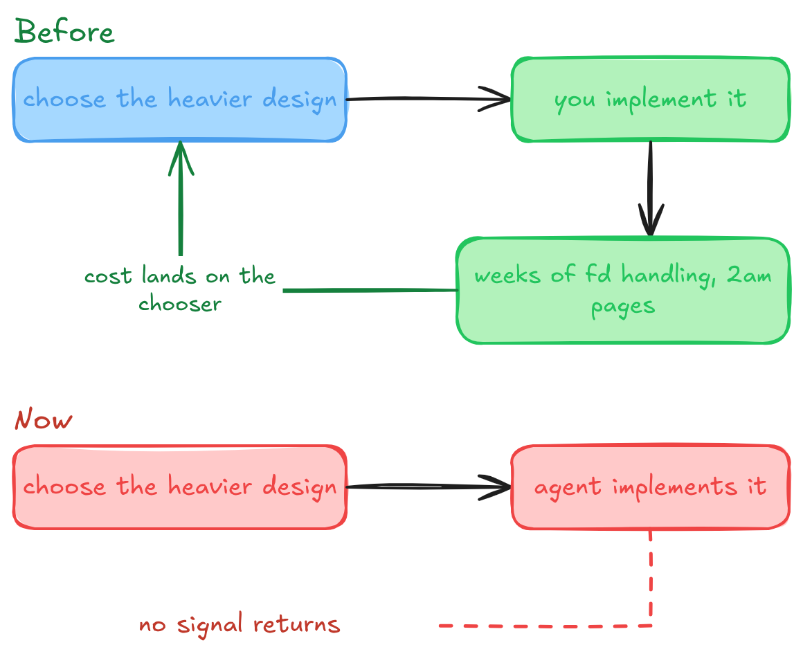
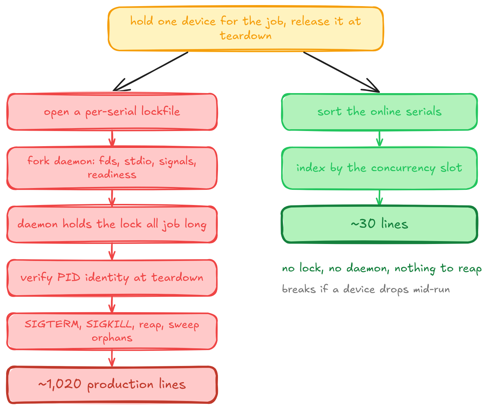

<figure style="float: left; width: 300px; margin: 0 1em 1em 0;" markdown>
  <a href="https://sysdev.me/img/over-engineering/belogorka-waterfall.jpg" target="_blank">
    
  </a>
  <figcaption>
    Belogorka waterfall, Sokuluk gorge. Two hours from "the office" and nothing there needs a daemon.
  </figcaption>
</figure>

A feature I'd sized at roughly 200 lines came back as 8,391 added and 692 removed, 3,431 of those lines being tests.

The requirement was one sentence. A CI job needs one of the two physical devices wired to the test rig, so: enumerate what's attached, pick one that's online, hand it back at teardown. What shipped was a forked daemon holding a `flock` for the lifetime of the job, PID identity verification against `/proc` start times, a SIGTERM to SIGKILL termination ladder, orphan sweeps, a readiness pipe, file-descriptor relocation, stdio detach, signal reset, and the tests to keep all of that honest.

Nothing there is an agent going off the rails. Every review finding was correct, and every guard defends against something that can really happen. The design is defensible option by option, which is the problem: the failure isn't visible anywhere except in the total. One incident, examined afterward against a census of my own configuration, so n is one.

<!-- more -->

## The column that got deleted

Think about picking between two designs in 2019. One is 150 lines with a known weakness. The other is a thousand lines with a background process and doesn't have that weakness. Part of what you weighed, without noticing you were weighing it, was three weeks of your life, a chunk of that spent on file-descriptor semantics, and a pager going off at 2am when the reaper missed an orphan.

Nobody wrote that down. No design template has a field for implementation cost, because the field was redundant: the person choosing was the person paying, and the bill arrived on its own.

{ width="800" }

We weren't disciplined, to be clear. We shipped mountains of over-built code, usually because something was interesting or looked good on a résumé, and plenty of it is still running. But over-engineering had a ceiling, and the ceiling was how much tedium one person would absorb before going to find the cheaper option. Low ceiling. Effective. It's now zero.

The nearest human analogue is a very smart junior who wants everything perfect, and the analogy breaks in the place that matters. Two years on the rig teaches a junior which failures actually arrive, and the perfectionism decays into judgment on its own. There's no trajectory here. Correct a person once and it sticks; correct this and it holds until the session ends, which is why every correction I've made ends up as a file on disk rather than a habit.

Here's what that costs in practice. A review finding objected to a device-health step of mine: if we fail to restore a device, assume the device is at fault. The objection was that restoring also fails on a corrupt package, a full runner disk, or a dead adb server, none of which say anything about the board, so a healthy device gets quarantined. All true. And a colleague who's run that rig for a year answers "sure, twice in eighteen months, both times obvious in the log" and it's over in four seconds. Frequency is what seasoning consists of. Without it, every true-but-negligible statement arrives at the weight of a real one, and enumerating them costs nothing, so you get the complete taxonomy rather than the three entries a bored human stops at.

## Where it shows

The design document enumerated seven options and rejected six. Each rejection is defensible on its own terms. One is load-bearing: a simpler lockfile scheme was thrown out to avoid a stale-holder identity problem, and the winning design then spent 550 lines solving the identical problem after relocating it from a lockfile to a daemon PID. The defect class didn't go away, it got a bigger budget.

That section runs 1,200 words across seven options and contains no number of any kind. Not lines, not files, not new-mechanism versus reuse. My template's version is four lines long: option name, pros, cons, decision.

So the agent wasn't choosing badly. It had nothing to compare on. Robustness was on the page in words, cost wasn't on the page at all, and one option got rejected on a diagnostics-quality argument that appears nowhere in the requirements section, which makes it unanswerable precisely because nothing can check it.

{ width="1024" }

An eighth option never made the page. The runner already runs exactly as many concurrent jobs as there are devices, because the chosen design leans on that for throttling, and it exposes a stable slot index per job.

```python
serials = sorted(online_serials)
device = serials[int(os.environ["CI_CONCURRENT_ID"])]
```

Distinct devices by construction. No lock, no daemon, no PID identity, nothing to reap. It has a real weakness: unplug a device while the concurrency setting stays put and two jobs index the same serial. Kernel-enforced correctness under fleet drift, against 970 lines and a background process. That's a one-sentence question with an obvious asker and an obvious answerer, and it was never asked, because the number that makes it obvious was never written down.

## The same thing at review time

Seven review passes on the design, producing 84 findings, exiting on "accepted after pass six without re-review." Round four alone returned 9 high-severity and 14 medium, all new rather than unresolved.

That doesn't happen with human reviewers, and not because human reviewers are better calibrated. It doesn't happen because round four is when somebody says enough. Fatigue is a convergence mechanism. Ugly, unprincipled, effective.

Tirelessness isn't the whole of it either. A tireless human with perfect recall would still converge, because they'd remember what they'd already accepted and stop reopening it. My fix loop retains exactly one thing between passes: the iteration counter. The review document is overwritten each pass, findings and severity IDs and all. Three separate files in my configuration claim git history preserves prior reviews, and all three are false, because that directory is gitignored and never had a file tracked. So each pass isn't continuing the review, it's drawing a fresh sample against a target that got bigger since last time. I did have stall detection, and it keys on the same root cause appearing *unresolved* three passes running, which is exactly the shape this doesn't have. Growth looks like progress from every angle that predicate can see.

Round four's headline was that mutation testing killed seven guards and the tests survived. They asserted things that could not fail. The honest reading is that the primitive had grown too intricate to test truthfully and should be replaced. The loop's terminal states are approved and changes-requested, so the only expressible reading is insufficient coverage. More tests. Of the 58 entries in my regression ledger, 50 originated as findings raised and fixed inside that loop, which means most of the permanent test surface guards defects that never existed outside the branch.

## The obvious diagnosis is wrong

Nothing deletes, sure. But that's a constant, not a variable. We didn't delete documentation before either, or dead code, or tests guarding behaviour nobody had shipped in years. If the bloat is new, the cause has to be something that changed, and deletion reluctance didn't change. It decides whether the result is permanent. It doesn't decide the volume.

## Putting the price tag back

One fix does most of the work: every option in a design carries two declared lines, what it costs in files and new mechanisms and test cases, and which stated requirement it fails, or "none." Then the cheap option wins by default and the expensive one is admissible only by naming a requirement the cheap one misses. In my design document that addition measures 31 words as a single table for all seven options.

It has a hole, and the hole is the same missing signal one level up. If enumerating failure modes is free and every enumerated mode lands in the requirements section formatted like a requirement, the override is always available. No back-filling needed, no bad faith. So a requirement can only override cost if its provenance is checkable by someone other than its author: it traces to the ticket, to a dated incident, or to an external authority like a protocol or a platform limit. Anything produced during analysis and never observed gets recorded and can't override. The axis isn't observed versus derived, since a constraint read off a spec is never observed and is genuinely hard. It's checkable by someone else, or not.

None of which enforces anything. The requirements and the options get written in the same pass by the same agent, document order isn't authoring order, and I can't prove which came first. What the cost line buys is that the trade sits somewhere a human comparing document against ticket has a chance of catching it.

What I actually miss is cheaper than any of this. I miss knowing, while reading option A, that picking it meant I'd be the one debugging fd inheritance on a Tuesday night. That did more design review than seven passes did.
