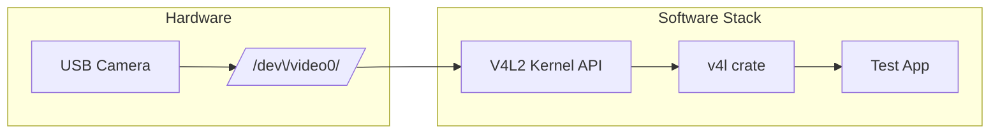
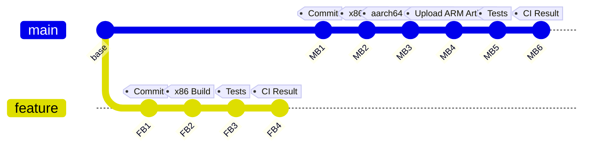

<figure style="float: left; width: 300px; margin: 0 1em 1em 0;" markdown>
  <a href="https://sysdev.me/img/pi_crab.png" target="_blank">
    
  </a>
</figure>

I just started a new embedded pet project on the Raspberry Pi, and I expect it'll be a pretty big one, so I've been thinking about the technology from the beginning. The overall goal is to create a glass-to-glass video pipeline example. Let's see how it's going. For now, I'm using a USB `V4L2` camera while waiting for the native Pi modules to arrive, but it's enough to sketch the capture loop and start testing the build pipeline. The application itself is minimal—open `/dev/video0`, request `YUYV` at 1280x720, set up `MMAP` buffers, and iterate over frames—but the real challenge occurs when `v4l` triggers `bindgen`, and the build must cross-compile cleanly for `aarch64`. 

The language choice immediately becomes part of the equation right away. Go is my favorite and, usually, is not considered as an option by many embedded developers. But it's a good choice for small embedded utilities because its cross-compilation story is nearly effortless. Need an ARM binary? One command and you have it!

```
GOOS=linux GOARCH=arm64 go build
```
<!-- more -->

But Go's garbage collector isn't something I want to use in a timing-sensitive video-processing capture loop. In theory, C++ seems like an alternative, but cross-compiling C++ code for any embedded platform is often a nightmare with toolchains, sysroots, and inconsistent environments. Frankly speaking, I'm not ready to do it just for fun; it's OK only if I'm getting paid for it. Rust falls into a more practical middle ground. Its build system is not as elegant as Go's, but it sidesteps the C++ toolchain maze and provides predictable behavior without GC pauses. It looks like a win-win for the Pi video-capture codebase.

The plan is straightforward: develop on fast `x86` hardware, reliably ship `aarch64` binaries, and avoid relying on the Pi itself for builds.

!!! info
    If you're not interested in the reasoning behind the project but just want a reference, I've created a [small repository for you](https://github.com/astavonin/pi-cam-capture/tree/ci-and-cross). It includes the capture loop, cross-compilation setup, CI pipeline, and all supporting configurations, presented exactly as they are today.

    It’s the straightforward, no-commentary version of this article.

## Test App: V4L Camera Capture

To start, I needed something as simple as possible while still being close to real life, so I chose a minimal Rust application that reads frames from a USB V4L2 camera. The goal wasn't to build a complete pipeline from the beginning. I first need to have minimal, but stable CI and cross-compilation in place, and this small capture loop is good enough to identify any toolchain problems in the early stages.



```rust
let dev = v4l::Device::new(0)?;

let mut fmt = dev.format()?;
fmt.width = 1280;
fmt.height = 720;
fmt.fourcc = v4l::FourCC::new(b"YUYV");

let _ = dev.set_format(&fmt)?;
let mut stream =
    v4l::io::mmap::Stream::with_buffers(&dev, v4l::buffer::Type::VideoCapture, 4)?;
while let Ok((buf, meta)) = stream.next() {
    println!("size={} seq={} ts={}", buf.len(), meta.sequence, meta.timestamp);
}
```

And I was right - you can't just take it and cross-compile it without any problems! Even this tiny example should have some issues during cross-compilation: the `v4l` crate, `bindgen`, and the need for the correct `libclang` inside the build environment.

## **Why Not Just gcc-aarch64-linux-gnu?**

You can easily wire the toolchain manually. It usually starts like this:

```bash
sudo apt install gcc-aarch64-linux-gnu
rustup target add aarch64-unknown-linux-gnu
```

Then you point Cargo at the cross-linker:

```toml
# .cargo/config.toml

[target.aarch64-unknown-linux-gnu]
linker = "aarch64-linux-gnu-gcc"
```

At this point, you can:

```

cargo build --target aarch64-unknown-linux-gnu

```

It is working at the moment I'm writing this text. I did test it. But it may also cause issues in the future. The linker might be fine, but `bindgen` now requires a compatible `libclang`, along with the correct headers and sysroot. If any of those are missing or mismatched, the build collapses into the usual cascade of `libclang` errors — exactly the experience that pushed me toward a dedicated cross-image instead.

By contrast, pushing everything into a dedicated cross-image turns the toolchain into a versioned artifact. The linker, sysroot, libclang, and all the supporting packages live in a single Docker image that I can rebuild, tag, and publish. The Rust project only needs a `Cross.toml` pointing at [ghcr.io/astavonin/cross-aarch64:llvm12](https://github.com/users/astavonin/packages/container/package/cross-aarch64) (yep, not a standard one from `ghcr.io/cross-rs/`, I'll explain it later), and both local builds and CI reuse precisely the same environment. That is the main reason I didn't stop at `gcc-aarch64-linux-gnu` and went straight to a containerized approach.

## Building a Custom cross Image

The natural question is, why not just use the stock `ghcr.io/cross-rs/aarch64-unknown-linux-gnu` image? It works for many projects, and for simple crates, it’s perfectly fine. The problem shows up the moment the build pulls in `v4l`, because that drags in `bindgen`, and `bindgen` depends on `libclang`. The default cross image ships an older `libclang` that doesn’t play well with some of the functions `bindgen` expects. That’s how you end up with the familiar error:

```
A libclang function was called that is not supported
called function = clang_getTranslationUnitTargetInfo
```

I started from the official cross-rs base:

```docker
FROM ghcr.io/cross-rs/aarch64-unknown-linux-gnu:latest
```

This image is based on **Ubuntu 16.04 Xenial**, which becomes a critical part in components selection. Xenial is old, and the available LLVM packages for it are limited. If you look at: [https://apt.llvm.org/xenial/dists/](https://apt.llvm.org/xenial/dists/), the highest LLVM/Clang version published for Xenial is **12**. That’s the ceiling. Anything newer doesn’t exist for this base distribution; we can use PPA if needed, but 12 is enough for my case.

So the choice of Clang wasn’t aesthetic — the platform dictated it. LLVM 12 is the newest supported toolchain you can install inside Xenial without rebuilding LLVM from source, and it’s new enough to keep `bindgen` happy for `v4l`.

The [Dockerfile](https://github.com/astavonin/cross-aarch64/blob/master/Dockerfile) installs the LLVM 12 family and exposes it to bindgen:

```docker
ENV LIBCLANG_PATH=/usr/lib/llvm-12/lib
ENV CLANG_PATH=/usr/bin/clang-12
ENV LLVM_CONFIG_PATH=/usr/bin/llvm-config-12
```

## Configuring Rust Projects with `Cross.toml`

Once the custom image is built, wiring it into a Rust project is trivial. This is the part I wanted to keep as boring as possible. All the configuration lives in a small `Cross.toml` file at the root of the repo. In that file, I simply tell Cross which Docker image to use for aarch64 builds, so both local builds and CI run against the same toolchain. 

A minimal configuration looks like this:

```ini
[target.aarch64-unknown-linux-gnu]
image = "ghcr.io/astavonin/cross-aarch64:llvm12"

[build.env]
passthrough = ["RUST_BACKTRACE"]
```

That’s all you need. Now the actual build becomes:

```bash
cross build --release --target aarch64-unknown-linux-gnu
```

And under the hood, cross will:

1. Pull or reuse your custom image with the correct libclang.
2. Mount the Rust project inside the container.
3. Invoke `cargo build` using the aarch64 toolchain baked into the image.

The important part here is that the toolchain is no longer spread across multiple machines or CI runners. Everything that matters — linker, sysroot, libclang, headers — travels together inside a versioned container.

## CI Strategy: Fast x86 Builds + On-Demand ARM Artifacts


Since this is a personal project and I am using the free GitHub plan, I need to minimize the time spent by the runners. Building natively for x86 on GitHub Actions provides quick feedback from unit tests and potentially integration tests. This approach avoids the costs associated with container startup and does not involve the aarch64 toolchain at all. This setup is sufficient for feature branches and routine development.




Cross-compiling for ARM comes with overhead: container startup, toolchain load, and bindgen doing its thing. It’s fine when you need an artifact, but wasteful for every feature branch. To avoid chewing through CI time and monthly limits, I only run aarch64 builds on main. Sure, will never do it for the production environment, but it looks like a perfect idea for this case.

This split keeps the feedback loop tight while still producing reliable ARM binaries when I actually need them. It also avoids depending on native ARM runners, which are either slower or require extra infrastructure. Everything runs on GitHub’s standard x86 machines, and the custom cross-image ensures the ARM build behaves exactly the same every time.

---

With the toolchain in place and the CI behaving predictably, it's time to move on to the parts of the project that actually matter. The tiny capture app still lacks many functionalities. Next comes testing with the native Pi camera modules, measuring queue depth, watching how the system behaves under thermal load, and shaping the first real version of the video pipeline.

